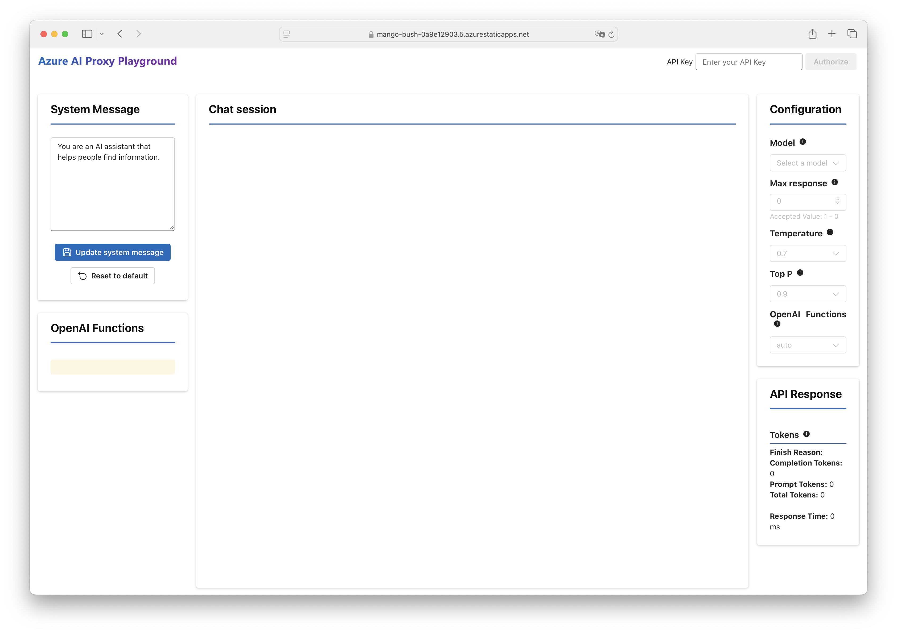
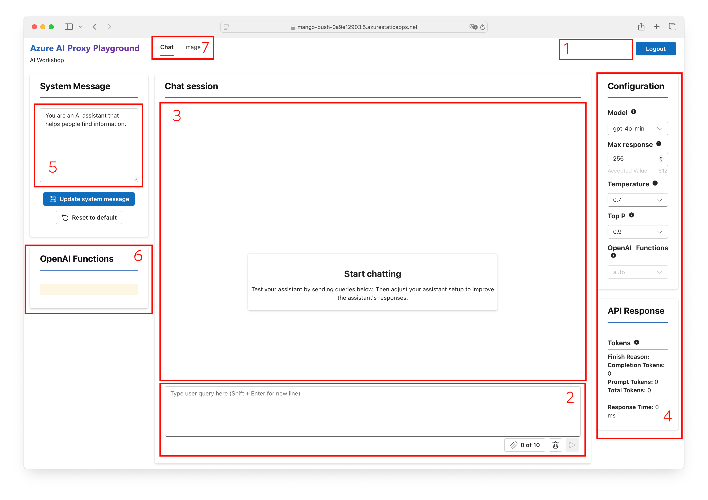

:::info WORKSHOP PRE-REQUISITES
 - **Use your own laptop**. 
 - **Launch a modern browser**. (Use edge or chrome for the best experience)
:::

For this workshop you are using a custom playground build on-top of the Azure OpenAI Service. In this playground you will 
have the oppertunity to play with the prompts and learn how to interact with OpenAI Models.


## Authenticate

Your workshop instructor will provide you with an **access key**.

Setup is now a quick 2-step process. 

1. 🗝 | **Get your access-key** - from your workshop organizers at the start of the event.
3. 💬 | **Use the access-key** - visit the [**Azure AI Proxy Playground**](https://mango-bush-0a9e12903.5.azurestaticapps.net/), enter access-key at top right, and click `Authorize`. 

 


## Explore
On successful login, the playground application should update to show a `Logout` button at top-right, as shown below. To validate your setup, enter a query in the user prompt input box (region 2) and click `Send`. You should get a conversational response in the chat session are (region 3) as shown below.

Let's take a minute to familiarize ourselves with the different regions of this app.



- Region 1️⃣ | Once authorized, shows the event profile.
- Region 2️⃣ | User prompt - used to enter text questions for AI
- Region 3️⃣ | Conversation - interleaved user questions & assistant responses
- Region 4️⃣ | Configuration - model selection, tunable parameters, execution stats
- Region 5️⃣ | System message - sets assistant persona, base context
- Region 6️⃣ | Function calling - save custom functions to set context
- Region 7️⃣ | Image generation - access the DALL-E model playground 


## Tips

### 1. Clear Chat Sessions

The output of the model is influenced by the contents of the chat session. To ensure that the output of the model is not influenced by previous prompts, click the "Clear Chat" button **before entering each new prompt**.

### 2. Copy-Paste Snippets

In a prompt-based exercise, you will find the prompt input is  provided to you in a _code-fenced_ snippet as shown below. When viewing this page in a browser, _click_ within the code-fenced region below to see a `copy` icon appear at the right. Click it to copy the prompt into your clipboard - then paste using <kbd>Ctrl-V</kbd> (or equivalent) command into the text input region in Playground.

```text
This is the prompt text you need to enter into the chat prompt input field.
```